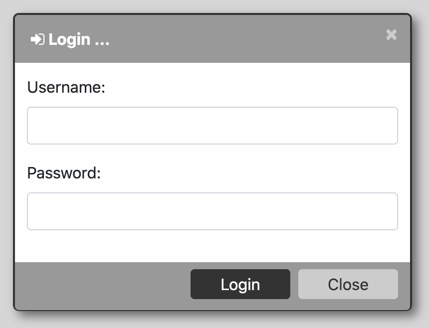
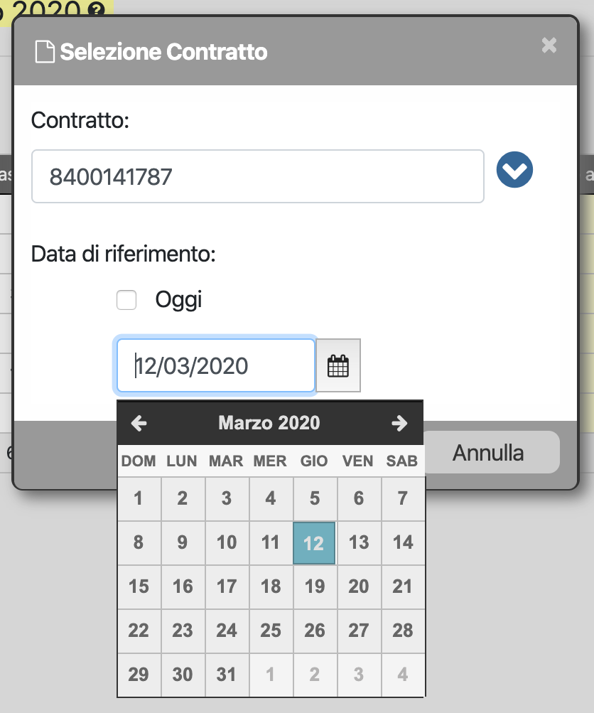
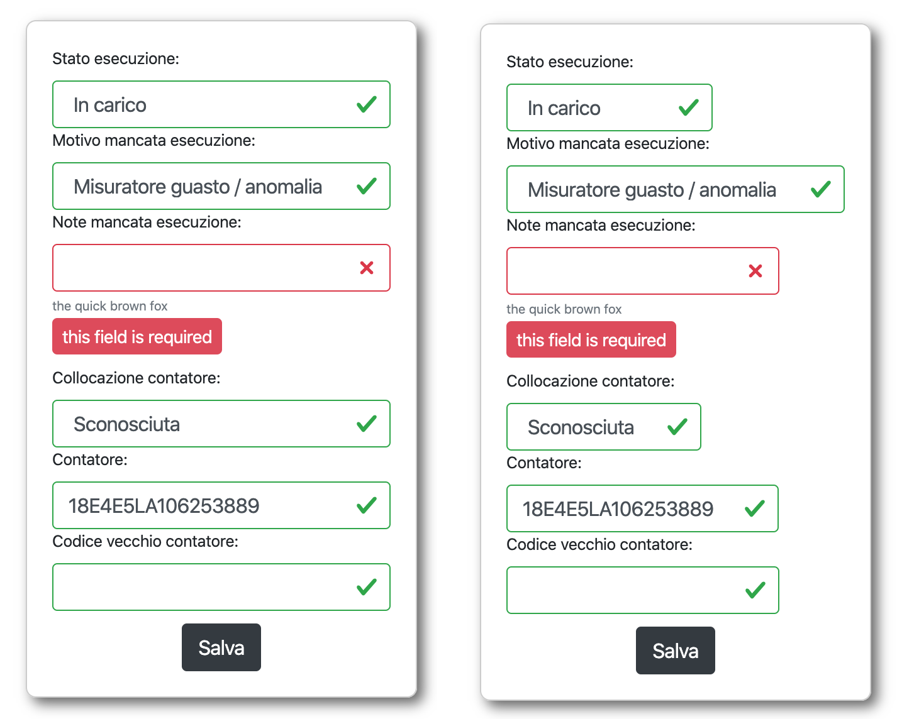

django-frontend-forms
=====================

A Django helper app to add editing capabilities to the frontend using modal forms.

Bases on my previous research as documented here: `Editing Django models in the front end <https://editing-django-models-in-the-frontend.readthedocs.io/en/latest/>`_

.. contents::

.. sectnum::

Demo site
---------

An accompaning `Demo site <http://django-frontend-forms-demo.brainstorm.it/>`_
provides:

- a detailed description of the techniques used under the hood
- a list of working code samples (source: https://github.com/morlandi/django-frontend-forms/tree/master/example/samples)

Installation
------------

Install the package by running:

.. code:: bash

    pip install django-frontend-forms

    or:

    pip install git+https://github.com/morlandi/django-frontend-forms

In your settings, add:

.. code:: python

    INSTALLED_APPS = [
        ...
        'frontend_forms',
    ]

Optionally, include library's views mapping (file `urls.py`):

.. code:: python

    urlpatterns = [
        ...
        path('frontend_forms/', include('frontend_forms.urls', namespace='frontend_forms')),
        ...

In your base template, include the default styles, the javascript support,
and optionally the sample HTML template:

.. code:: html

    <link rel='stylesheet' href="">
    
    

**OPTIONALLY**, since the js code uses the `class` keyword, you might want to transpile
`frontend_forms.jsx` for maximum compatibility, to support oldest browsers.

For example, using Babel and django-compress:

.. code:: html

    

then, setup handling for ".jsx" files as follows::

    COMPRESS_PRECOMPILERS = (
        ...
        ('text/jsx', 'cat {infile} | ./node_modules/babel-cli/bin/babel.js --presets babel-preset-es2015 > {outfile}'),
    )

(you my want to disable it local debugging)::

    # Remove js transpiling for easier debugging
    COMPRESS_PRECOMPILERS = (
        ...
        ('text/jsx', 'cat {infile} | ./node_modules/babel-cli/bin/babel.js > {outfile}'),
    )

then:

.. code:: bash

    npm install babel-cli
    npm install babel-preset-es2015
    npm install babel-preset-stage-2

How to use
----------

Two actions are required:

1) provide an HTML template for the dialog layout
2) attach the template to a `Dialog` javascript object to control it's behaviour

Since in most cases you will be primarily interested in customizing the modal content only,
a default template is provided to render a generic dialog (file frontend_forms/templates/frontend_forms/dialogs.html).

Dialog methods
..............

=============================== ===================================================================================================================
Method                          Effects
------------------------------- -------------------------------------------------------------------------------------------------------------------
constructor(options={})         See `options` list below
open(event=null, show=true)     Open the dialog

                                1. the dialog body will be immediately loaded with static content provided by option "html"
                                2. then the dialog is shown (unless the "show" parameter is false)
                                3. finally, dynamic content will be loaded from remote address provided by option "url" (if supplied)
                                4. if successfull, a 'loaded.dialog' event is fired; you can use it to perform any action required after loading

close()                         Close (hide) the dialog
show()                          Make the dialog visible

=============================== ===================================================================================================================

Dialog options
..............

=============================== ========================== ===============================================================
Option                          Default value              Notes
------------------------------- -------------------------- ---------------------------------------------------------------
dialog_selector                 '#dialog_generic'          The selector for HTML dialog template
open_event                      null                       Used to "remember" the event which triggered Dialog opening
html                            ''                         Static content to display in dialog body
url                             ''                         Optional url to retrieve dialog content via Ajax
width                           null
min_width                       null
max_width                       null
height                          null
min_height                      null
max_height                      null
button_save_label               'Save'
button_save_initially_hidden    false                      Will be shown after form rendering
button_close_label              'Cancel'
title                           ''
footer_text                     ''
enable_trace                    false                      show notifications in debug console
callback                        null                       a callback to receive events
autofocus_first_visible_input   true
=============================== ========================== ===============================================================

Dialog notifications
....................

============================  ================================
event_name                    params
============================  ================================
created                       options
closed
initialized
shown
loading                       url
loaded                        url, data
loading_failed                jqXHR, textStatus, errorThrown
open
submitting                    method, url, data
submitted                     method, url, data
============================  ================================

During it's lifetime, the Dialog will notify all interesting events to the caller,
provided he supplies a suitable callback in the contructor:

    self.options.callback(event_name, dialog, params)

Example:

.. code:: javascript

    dialog1 = new Dialog({
        ...
        callback: function(event_name, dialog, params) {
            console.log('event_name: %o, dialog: %o, params: %o', event_name, dialog, params);
        }
    });

Result::

    event_name: "created", dialog: Dialog {options: {…}, element: …}, params: {options: {…}}
    event_name: "initialized", dialog: Dialog {options: {…}, element: …}, params: {}
    event_name: "open", dialog: Dialog {options: {…}, element: …}, params: {}
    event_name: "shown", dialog: Dialog {options: {…}, element: …}, params: {}
    event_name: "loading", dialog: Dialog {options: {…}, element: …}, params: {url: "/admin_ex/popup/"}
    event_name: "loaded", dialog: Dialog {options: {…}, element: …}, params: {url: "/admin_ex/popup/"}
    event_name: "submitting", dialog: Dialog {options: {…}, element: …}, params: {method: "post", url: "/admin_ex/popup/", data: "text=&number=aaa"}
    event_name: "submitted", dialog: Dialog {options: {…}, element: …}, params: {method: "post", url: "/admin_ex/popup/", data: "text=111&number=111"}
    event_name: "closed", dialog: Dialog {options: {…}, element: …}, params: {}

You can also trace all events in the console setting the boolean flag `enable_trace`.

Opening a Dialog
----------------

In the following example, we build a Dialog() object providing some custom options;
then, we use it to open a modal dialog and load it from the specified url.

For demonstration purposes, we also subscribe the 'created' notification.

.. code:: html

    

    <a href="#" class="btn btn-primary pull-right" onclick="dialog1.open(event); return false;">
        <i class="fa fa-plus-circle"></i>
        Test Popup
    </a>

Open the Dialog and perform some actions after content has been loaded
----------------------------------------------------------------------

In the following example:

- we subscribe the 'loaded' event
- we call open() with show=false, so the Dialog will remain hidden during loading
- after loading is completed, our handle is called
- in this handle, we show the dialog and hide it after a 3 seconds timeout

Sample usage in a template:

.. code:: html

    

    <a href="#" onclick="dialog2.open(event, show=false); return false;">
        <i class="fa fa-plus-circle"></i>
        Test Popup (2)
    </a>

Handling form submission
------------------------

When a form submission is involved, the modal life cycle has to be modified as follows:

- First and foremost, we need to **prevent the form from performing its default submit**.

  If not, after submission we'll be redirected to the form action, outside the context
  of the dialog.

  We'll do this binding to the form's submit event, where we'll serialize the form's
  content and sent it to the view for validation via an Ajax call.

- Then, upon a successufull response from the server, **we'll need to further investigate
  the HTML received**:

    + if it contains any field error, the form did not validate successfully,
      so we update the modal body with the new form and its errors

    + otherwise, user interaction is completed, and we can finally close the modal

`django-frontend-forms`, upon detecting a form in the content downloaded from the server,
already takes care of all these needs automatically, and keeps refreshing the modal
after each submission until the form validation succeedes.

Giving a feedback after successful form submission
--------------------------------------------------

Sometimes, you might want to notify the user after successful form submission.

To obtain this, all you have to do, after the form has been validated and saved,
is to return an HTML fragment with no forms in it; in this case:

- the popup will not close
- the "save" button will be hidden

thus giving to the user a chance to read your feedback.

.. code:: bash

    def form_validation_with_feedback(request):

        assert request.is_ajax()

        if request.method == 'POST':
            form = MyForm(data=request.POST)
            if form.is_valid():
                form.save()
                return HttpResponse("<h1>Great !</h1> Your form has been validated")
        else:
            form = MyForm()

        return render(request, "my_form.html", {
            'form': form,
        })

Logging in with a modal form
----------------------------

If you're trying to minimize page switching and reduce navigation in your frontend,
why not provide a modal window for login as well ?

The library contains a login view adapted from the standard (function based) Django
login view, which can be used for either a standalone HTML page or in a Dialog.

For example:

.. code:: html

    <a id="login_with_dialog" href="">
        <i class="fa fa-sign-in"></i>
        Login
    </a>

    

You can customize the following templates:

- frontend_forms/login.html
- frontend_forms/login_inner.html
- frontend_forms/login_successful_message.html

Replacing login_required
------------------------

A decorator suitable for modal forms is provided to replace login_required():

.. code:: python

    from frontend_forms.decorators import check_logged_in

    @check_logged_in()
    def my_view(request, ...):
        ...

It checks that the user is logged in, showing an error message in place if not.

You can customize the following template:

- frontend_forms/check_logged_in_failed.html

A full, real example for a Django Form submission from a Dialog
---------------------------------------------------------------

We start by creating a view for form rendering and submission:

file `ajax.py`:

.. code:: python

    import time
    from frontend_forms.decorators import check_logged_in
    from django.views.decorators.cache import never_cache
    from django.core.exceptions import PermissionDenied
    from django.http import HttpResponseRedirect

    @check_logged_in()
    @never_cache
    def select_contract(request):

        # if settings.DEBUG:
        #     time.sleep(0.5);

        if not request.user.has_perm('backend.view_contract') or not request.is_ajax():
            raise PermissionDenied

        #template_name = 'frontend/dialogs/generic_form_inner_with_video.html'
        template_name = 'dashboard/dialogs/select_contract.html'

        object = None
        if request.method == 'POST':
            form = SelectContractForm(request=request, data=request.POST)
            if form.is_valid():
                object = form.save(request)
                if not request.is_ajax():
                    # reload the page
                    next = request.META['PATH_INFO']
                    return HttpResponseRedirect(next)
                # if is_ajax(), we just return the validated form, so the modal will close
        else:
            form = SelectContractForm(request=request)

        return render(request, template_name, {
            'form': form,
            'object': object,  # unused, but armless
        })

and provide an endpoint to it for ajax call:

file `urls.py`

.. code:: python

    from django.urls import path
    from . import ajax

    app_name = 'dashboard'

    urlpatterns = [
        ...
        path('j/select_contract/', ajax.select_contract, name='j_select_contract'),
        ...
    ]

The Form in this example does a few interesting things:

- includes some specific assets declaring an inner Media class
- receives the request upon construction
- uses it to provide specific initial values to the widgets
- provides some specific validations with `clean()`
- encapsulates in `save()` all actions required after successfull submission

file `forms.py`:

.. code:: python

    import json
    import datetime
    from django import forms
    from selectable.forms import AutoCompleteWidget, AutoCompleteSelectWidget, AutoComboboxSelectWidget
    from backend.models import Contract
    from django.utils.safestring import mark_safe
    from .lookups import ContractLookup

    class SelectContractForm(forms.Form):

        contract = forms.CharField(
            label='Contract',
            widget=AutoComboboxSelectWidget(ContractLookup, limit=10),
            required=True,
            help_text=mark_safe("&nbsp;"),
        )
        today = forms.BooleanField(label="Oggi", required=False)
        date = forms.DateField(widget=forms.DateInput(), label='', required=False)

        class Media:
            css = {
                'screen': ('dashboard/css/select_contract_form.css', )
            }
            js = ('dashboard/js/select_contract_form.js', )

        def __init__(self, request, *args, **kwargs):
            super().__init__(*args, **kwargs)
            self.fields['date'].widget = forms.DateInput(attrs={'class': 'datepicker'})
            assert request.user.is_authenticated and request.user.is_active
            self.fields['contract'].initial = request.user.contract_attivo
            self.fields['date'].initial = request.user.data_attiva
            self.fields['today'].initial = request.user.data_attiva is None

        def lookup_contract(self):
            try:
                contract = Contract.objects.get(
                    id=self.cleaned_data['contract']
                )
            except Contract.DoesNotExist:
                contract = None
            return contract

        def clean(self):
            cleaned_data = self.cleaned_data
            if not cleaned_data['today'] and not cleaned_data['date']:
                raise forms.ValidationError({
                    'date': 'Questo campo è obbligatorio'
                })
            return cleaned_data

        def save(self, request):
            user = request.user
            assert request.user.is_authenticated and request.user.is_active
            user.contract_attivo = self.lookup_contract()
            if self.cleaned_data['today']:
                user.data_attiva = None
            else:
                user.data_attiva = self.cleaned_data['date']
            user.save(update_fields=['contract_attivo', 'data_attiva', ])

The javascript and css assets are used for specific needs of this form:

.. code:: javascript

    function onChangeToday(event) {
        var controller = $('#id_today');
        var value = controller.is(":checked");
        $('#id_date').prop('disabled', value);
        $('.field-date .ui-datepicker-trigger').prop('disabled', value);
        if (value) {
            $('#id_date').datepicker('setDate', null);
        }
    }

    $(document).ready(function() {
        $('#id_today').on('change', onChangeToday);
        onChangeToday();
    });

In the template, remember to include the Form's assets:

.. code:: html

    

    {{ form.media.css }}

    

        

            <form action="{{ action }}" method="post" class="form {{form.form_class}}" novalidate autocomplete="off">
                

                
                    


                

                
                    <ul class="errorlist">
                        
                            <li>{{ error }}</li>
                        
                    </ul>
                

                
                    {{ hidden_field }}
                

                <fieldset>
                    
                    
Data di riferimento:

                    

                        
                        
                    

                </fieldset>

                <input type="hidden" name="object_id" value="{{ object.id|default:'' }}">
                

                    <input type="submit" value="Save" />
                

            </form>
        

    

    
        {{ form.media.js }}
    

And finally, the Dialog itself;

please note that we use the `loaded` event notification to rebind the widgets
after form rendering.

.. code:: html

    
    
    

Editing a Django Model from a Dialog
------------------------------------

TODO: TO BE REFINED ... AND VERIFIED ;)

First of all, we need a view for form rendering and submission.

For example:

.. code:: python

    @check_logged_in()
    @never_cache
    def edit_something(request, id_object=None):

        # if not request.user.has_perm('backend.view_something') or not request.is_ajax():
        #     raise PermissionDenied

        if id_object is not None:
            object = get_object_or_404(Something, id=id_object)
        else:
            object = None

        template_name = 'frontend_forms/generic_form_inner.html'

        if request.method == 'POST':

            form = SomethingForm(data=request.POST, instance=object)
            if form.is_valid():
                object = form.save(request)
                if not request.is_ajax():
                    # reload the page
                    next = request.META['PATH_INFO']
                    return HttpResponseRedirect(next)
                # if is_ajax(), we just return the validated form, so the modal will close
        else:
            form = SomethingForm()

        return render(request, template_name, {
            'form': form,
            'object': object,  # unused, but armless
        })

where:

.. code:: python

    class SomethingForm(forms.ModelForm):

        class Meta:
            model = Someghing
            exclude = []

        ...

and an endpoint for Ajax call:

File "urls.py" ...

.. code:: python

    path('j/edit_something/<int:id_object>/', ajax.edit_something, name='j_edit_something'),

We can finally use the form in a Dialog:

.. code:: javascript

    $(document).ready(function() {

        dialog1 = new Dialog({
            dialog_selector: '#dialog_generic',
            html: '<h1>Loading ...</h1>',
            url: '/j/edit_something/{{ object.id }}/',
            width: '400px',
            min_height: '200px',
            title: '<i class="fa fa-add"></i> Edit',
            footer_text: '',
            enable_trace: true,
            callback: function(event_name, dialog, params) {
                switch (event_name) {
                    case "created":
                        console.log('Dialog created: dialog=%o, params=%o', dialog, params);
                        break;
                    case "submitted":
                        FrontendForms.hide_mouse_cursor();
                        FrontendForms.reload_page(true);
                        break;
                }
            }
        });

    });

Default dialog layout
---------------------

When contructing a Dialog, you can use the `dialog_selector` option to select which
HTML fragment of the page will be treated as the dialog to work with.

It is advisable to use an HTML structure similar to the default layout:

.. code:: html

    

        

            

                

                    
                        <i class="fa fa-spinner fa-spin"></i>
                    
                    &times;
                    
Title

                

                

                

                

                    <input type="submit" value="Close" class="btn btn-close" />
                    <input type="submit" value="Save" class="btn btn-save" />
                    
footer

                

            

        

    

Notes:

- ".draggable" make the Dialog draggable
- adding ".ui-front" to the ".dialog-box" element helps improving the behaviour of the dialog on a mobile client

Settings
--------

FRONTEND_FORMS_FORM_LAYOUT_FLAVOR
    Default flavor for form rendering
        - Default: "generic"
        - Accepted values: "generic", "bs4"

"bs4" flavor
------------

Add the .compact-fields class to the form to modify the layout as in the right picture below:

Utilities (module FrontendForms)
--------------------------------

- display_server_error(errorDetails)
- redirect(url, show_layer=false)
- gotourl(url, show_layer=false)
- reload_page(show_layer=false)
- overlay_show(element)
- overlay_hide(element)
- hide_mouse_cursor()
- logObject(element, obj)
- dumpObject(obj, max_depth, depth)
- isEmptyObject(obj)
- cloneObject(obj)
- lookup(array, prop, value)
- adjust_canvas_size(id)
- getCookie(name)
- confirmRemoteAction(url, options, afterDoneCallback, data=null)
- downloadFromAjaxPost(url, params, headers, callback)
- querystring_parse(qs, sep, eq, options)
- set_datepicker_defaults(language_code)
- apply_multiselect(elements)

Form rendering helpers
----------------------

A **render_form(form, flavor=None, layout=FORM_LAYOUT_DEFAULT)** template tag is available for form rendering:

.. code:: html

    

    <form method="post">
        

        

        

            <button type="submit" class="btn btn-lg btn-primary btn-block"></button>
        

    </form>

For more a more advanced customization, you can use **render_form_field(field, flavor=None, extra_attrs='', layout=FORM_LAYOUT_DEFAULT, index=0, addon='')** instead:

.. code:: html

    

    <form method="post">
        

        
            <ul class="errorlist">
                
                    <li>{{ error }}</li>
                
            </ul>
        

        
            {{ hidden_field }}
        

        <fieldset>
            
            
        </fieldset>

        

            <button type="submit" class="btn btn-lg btn-primary btn-block"></button>
        

    </form>

In this second example, we supply `extra_attrs` attributes to each form field; these will be added to the
attributes already derived from the Django Form field definitions.

The special prefix `^` will be removed from the attribute, and interpreted as "replace" instead of "append".

A generic template is also available:

`generic_form_inner.html`:

.. code:: html

    

    

        

            <form action="{{ action }}" method="post" class="form" novalidate autocomplete="off">
                
                
                <input type="hidden" name="object_id" value="{{ object.id|default:'' }}">
                

                    <input type="submit" value="Save" />
                

            </form>
        

    

Please note that, as a convenience when editing a Django Model, we've added an hidden field `object_id`;
in other occasions, this is useless (but also armless, as long as the form doesn't
contain a field called "object").

Datepicker support
------------------

A basic support is provided for jquery-ui datepicker.

Follow these steps:

(1) Initialize datepicker default by calling `FrontendForms.set_datepicker_defaults(language_code)` once:

.. code:: javascript

    
    

Follow these steps:

(1) In your form, add the `multiselect` class to the SelectMultiple() widget

.. code:: python

    class MyForm(forms.ModelForm):

        ...

        def __init__(self, *args, **kwargs):
            super().__init__(*args, **kwargs)
            self.fields['operators'].widget.attrs = {'class': 'multiselect'}

(2) Later on, bind the widget using `apply_multiselect()` helper:

.. code:: javascript

    dialog1 = new Dialog({
        ...
        callback: function(event_name, dialog, params) {
            switch (event_name) {
                case "loaded":
                    FrontendForms.apply_multiselect(dialog.element.find('.multiselect'));
                    break;
                ...
            }
        }
    });

django-select2 support
----------------------

Requirements (in file "base.html")::

    <link rel="stylesheet" type="text/css" href="" />

    
    
    
    <script src=""</script>

Follow these steps:

(1) In your form, use one or more Select2Widget():

.. code:: python

    from django_select2.forms import HeavySelect2Widget

    class MyForm(forms.ModelForm):

        ...

        class Meta:
            ...
            widgets = {
                'fieldname': HeavySelect2Widget(
                    data_url='/url/to/json/response'
                )
            }

(2) Later on, bind the widgets using `djangoSelect2()` helper:

.. code:: javascript

    dialog1 = new Dialog({
        ...
        callback: function(event_name, dialog, params) {
            switch (event_name) {
                case "loaded":
                    dialog.element.find('.django-select2').djangoSelect2({

                        // "dropdownParent" is required for Bootstrap; see:
                        // https://select2.org/troubleshooting/common-problems#select2-does-not-function-properly-when-i-use-it-inside-a-bootst

                        dropdownParent: dialog.element
                    });
                    break;
                ...
            }
        }
    });

I normally opt to include all required static files in "base.hmtml", since I'm already
including so much javascript stuff.

In this case, make sure django-select2 won't istall them twice;
for example:

.. code:: python

    class MySelect2Widget():
        """
        Avoid inclusion of select2 by django-select2 as a result of {{form.media}},
        since we're already including everything in base.html
        """
        def _get_media(self):
            return None
        media = property(_get_media)

    class AlbumWidget(MySelect2Widget, ModelSelect2Widget):
        model = Album
        search_fields = [
            'name__istartswith',
        ]

        def build_attrs(self, base_attrs, extra_attrs=None):
            attrs = super().build_attrs(base_attrs=base_attrs, extra_attrs=extra_attrs)
            # "data-minimum-input-length";
            # - either override build_attrs() here,
            # - or provide as attr in the instance; for example:
            #   'album': AlbumWidget(attrs={'data-minimum-input-length': 0,}),
            attrs['data-minimum-input-length'] = 0
            return attrs
